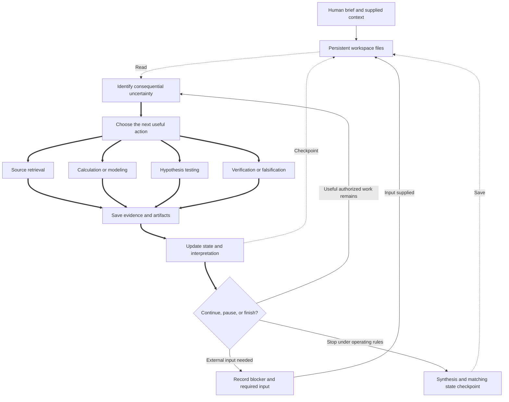

# Autonomous research architecture

The research agent chooses useful actions in an adaptive, evidence-driven loop. The workspace preserves progress across runs. Actions below are options, not mandatory phases; delegation is optional under the operating rules, with no prescribed agent hierarchy.

[PROJECT.md](PROJECT.md) is the human brief; [AGENTS.md](AGENTS.md) supplies operating rules. The agent saves traceable evidence and consequential decisions in [evidence/RECORDS.md](evidence/RECORDS.md), reproducible work in [analysis/](analysis/README.md), and a concise handoff in [STATE.md](STATE.md). [outputs/REPORT.md](outputs/REPORT.md) holds the synthesis. Evidence and artifacts are saved before the state checkpoint that cites them.
