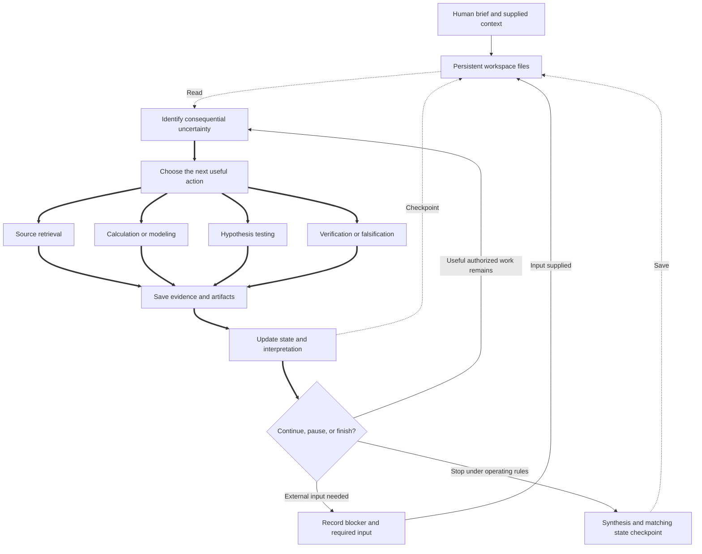

# Autonomous research architecture

The research agent chooses useful actions in an adaptive, evidence-driven loop. The workspace preserves progress across runs. Actions below are options, not mandatory phases; delegation is optional under the operating rules, with no prescribed agent hierarchy.

[PROJECT.md](PROJECT.md) is the human brief; [AGENTS.md](AGENTS.md) supplies operating rules. The agent saves traceable evidence and consequential decisions in [evidence/RECORDS.md](evidence/RECORDS.md), reproducible work in [analysis/](analysis/README.md), and a concise handoff in [STATE.md](STATE.md). [outputs/REPORT.md](outputs/REPORT.md) holds the synthesis. Evidence and artifacts are saved before the state checkpoint that cites them.

## Scientific computation layers

These are interchangeable capabilities within the adaptive loop, not a required pipeline. Use a hand derivation when sufficient; exact structure can bypass numerical search, and an immature conjecture rarely warrants formalization.

| Layer | Implementation | Promotion boundary |
| --- | --- | --- |
| A: numerical exploration | NumPy, SciPy, mpmath, matplotlib; small CTMC helpers | Residuals, conditioning and precision checks supply numerical evidence |
| B: exact/symbolic mathematics | Fraction, SymPy matrices/polynomials/limits/transforms; optional Sage | Exact domains, assumptions, poles and singular strata must be justified |
| C: graph/topology exploration | NetworkX atlas, isomorphism, cycle invariants and observation orbits; optional nauty | Exhaustive support enumeration is not exhaustive continuous-rate classification |
| D: adversarial conjecture testing | Seeded/log-uniform search, differential evolution, constrained refinement, reconstruction | Candidate counterexamples require admissibility and exact verification; failed search is no proof |
| E: existence/constraint reasoning | SymPy equations/elimination; optional Z3, Sage/QEPCAD | Exact encoded `sat`/`unsat` decisions have a stated solver trust boundary; `unknown` is inconclusive |
| Optional formal verification | Pinned Lean 4 + Mathlib scaffold | Successful compilation, matching mathematical statement and accepted axioms; currently uncompiled |

The [stack guide](docs/research-stack.md) gives environment setup, APIs, reproducibility and limits; [research workflow](docs/research-workflow.md) governs falsification, independent checking and mathematical status. Claims use existing evidence records, with a status field rather than another database. [Optional tools](docs/optional-tools.md) remain isolated from ordinary Python research. [Capability tests](analysis/capabilities/README.md) have their own artifacts and never populate scientific evidence as discoveries. See the dated [capability audit](docs/capability-audit.md) for tested availability and remaining limitations.
