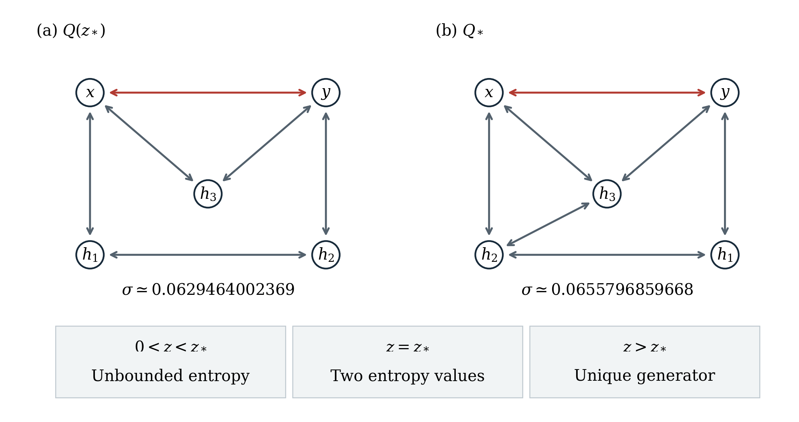

# Markov thermodynamic identifiability

When do complete waiting-time statistics between observed transitions determine a Markov network's dissipation? This repository contains theoretical results, exact and numerical checks, and a complete manuscript on thermodynamic identifiability in partially observed finite-state continuous-time Markov chains.

**Central result:** exact observations can restrict entropy production to exactly two values, while arbitrarily small observational uncertainty still permits arbitrarily large entropy production. Exact identifiability and stable upper inference are different properties.

## Read the paper

**Exact entropy-production fibers and local upper bounds in partially observed Markov networks**

- [Manuscript PDF](manuscript/main.pdf) — 29 pages, including the full proof appendices.
- [LaTeX source and build guide](manuscript/README.md) — verified bibliography, two reproducible figures, and computational provenance.
- [Complete reproduction archive](outputs/manuscript-package.zip) — preserves the surrounding scientific dependencies and includes a per-file SHA-256 manifest.
- [Publication-readiness assessment](outputs/PUBLICATION-READINESS.md) — contribution, closest prior work, limitations, and remaining review risks.

**Status: ready for expert human review.** The results have conventional proofs supported by exact algebraic/interval checks and numerical cross-checks; they are not formally verified. Originality remains provisional relative to the inspected literature. Expert assessment of the global support-exhaustion proof is the highest-value next check, and author details and final submission decisions remain pending.

## Main results

The central observation model resolves one known microscopic transition pair in a finite irreducible CTMC. Support is reciprocal but otherwise unknown, states are even under time reversal, and each ordered state pair has one kinetic channel. Observations retain the full joint next-transition mark and waiting-time law, including its absolute time scale. The [mathematical specification](analysis/publication-theorems.md) gives the precise model classes and quantifiers.

For an explicit balanced five-state family, the **entire compatible entropy set** under a five-state cap has a sharp transition:

| Parameter | Compatible entropy-production rates |
| --- | --- |
| $0<z<z_*$ | Unbounded above |
| $z=z_*$ | Exactly two distinct finite values |
| $z>z_*$ | One value, with a unique physical generator up to hidden-state relabeling |

The threshold $z_*\approx10.5571496686650$ is the unique positive root of $352z^4-3168z^3-4644z^2-11340z-7623=0$. The classification exhausts all admissible supports, including exceptional parameter cases. Allowing a sixth state makes the entropy set unbounded through an exact data-preserving construction. [Proofs and evidence](evidence/RECORDS.md#e051)



Two further results explain the distinction between exact identification and stability:

- **Sharp local upper-bound criterion.** With exactly $N$ states and unknown reciprocal support, a finite entropy upper ceiling on some joint-kernel neighborhood exists precisely for $N=2$, or for $N=3$ with a complete source triangle. Every source with $N\ge4$ has unbounded entropy in every positive observational neighborhood, even with observed rates and trace fixed. An additional arbitrary tight rate cap or known topology can change this conclusion. [Evidence](evidence/RECORDS.md#e061)
- **Stable rates can coexist with unstable entropy.** At every irreducible three-state source, three positive Laplace arguments give a locally Lipschitz generator inverse in joint-kernel row total variation, without a prior rate cap. Entropy is locally Lipschitz at positive triangles but can diverge near trees despite generator convergence. The explicit tree example preserves trace $-4$ and rates at most one. [Inverse result](evidence/RECORDS.md#e060), [counterexample](evidence/RECORDS.md#e057)

The balanced-family classification does not settle arbitrary five- or six-state exact fibers. Cap-free positive continuity for stationary finite-window observations also remains open. Failed conjectures, boundary cases, inaccessible-source caveats, and prior-work comparisons are retained in the [research report](outputs/REPORT.md) and [claim-to-evidence audit](analysis/manuscript-audit.md).

## Reproduce the results

Clone the repository or extract the complete archive, preserving its directory structure. Reading the paper and proof notes requires no scientific packages. To rerun the checks, use an isolated Python environment; the recorded environment uses Python 3.9.12 and the [pinned research requirements](analysis/requirements-research.txt).

From the repository root in PowerShell:

```powershell
python -m venv .venv
.venv/Scripts/python.exe -m pip install -r analysis/requirements-research.txt
.venv/Scripts/python.exe -B analysis/manuscript-math-independent-check.py
.venv/Scripts/python.exe -B manuscript/scripts/reproduce.py
.venv/Scripts/python.exe -B manuscript/scripts/check_table_bounds.py
```

On macOS/Linux, use `.venv/bin/python` instead of `.venv/Scripts/python.exe`; the recorded verification environment is Windows. Do not use Python `-O`, because assertions are part of the checks.

The reproduction driver replays 15 scientific scripts with historical output writes intercepted, compares their scientific payloads, checks preservation of existing JSON outputs, and regenerates the publication figures. All 15 replays and 12 printed rational table bounds passed. A [fresh-extraction check](manuscript/supplementary/archive-replay-checks.json) reproduced the PDF byte for byte using the same installed runtime and cached TeX resources. These checks support reproducibility; the global mathematical claims rest on the proofs.

To compile the paper, install Tectonic or a TeX distribution with REVTeX and BibTeX, then run `python manuscript/scripts/build.py`. The [manuscript guide](manuscript/README.md) documents the tested compiler, build options, validation, and archive creation. The [scientific stack guide](docs/research-stack.md) covers additional research tools.

## Explore the research atlas

The [interactive knowledge atlas](knowledge/README.md) connects claims, assumptions, proofs, calculations, counterexamples, and prior work across 12 views. After cloning or extracting the repository, open `knowledge/interactive/index.html` locally; it has no network dependencies. On GitHub, start with the [static overview](knowledge/views/research_overview.svg) or [scientific story](knowledge/views/scientific_story.svg).

The atlas provides navigation and provenance, not additional proof or novelty certification. Its source of truth is the linked evidence and mathematical artifacts.

## Start or resume

The current manuscript task is finished. For a subsequent research or revision task, open this repository in a capable research agent and send:

> Read AGENTS.md, PROJECT.md, and STATE.md. Follow my current task scope and the saved handoff. Preserve the human brief and established evidence, verify relevant existing work before repeating it, and checkpoint any consequential new result. A finished investigation should reopen only for a concrete reason.

[PROJECT.md](PROJECT.md) is the human-owned research objective; [STATE.md](STATE.md) is the current checkpoint, not a live process indicator. These files preserve continuity across interruptions; they do not run an agent or schedule work. The [workflow](docs/research-workflow.md) distinguishes numerical evidence, conventional proof, solver certification, and formal verification.

## Files and ownership

| Location | Owner | Purpose |
| --- | --- | --- |
| [PROJECT.md](PROJECT.md) | Human | Compact research objective; preserve it during research. |
| [AGENTS.md](AGENTS.md) | Framework maintainer | General operating rules, evidence conventions, autonomy, and stopping rules. |
| [ARCHITECTURE.md](ARCHITECTURE.md) | Framework maintainer | The adaptive research loop and persistence model. |
| [STATE.md](STATE.md) | Agent | Current understanding, uncertainty, success criteria, and next action. |
| [evidence/RECORDS.md](evidence/RECORDS.md) | Agent | Stable evidence and decision records with source provenance. |
| [analysis/](analysis/README.md) | Agent | Reproducible calculations, scripts, symbolic work, and derived artifacts. |
| [manuscript/](manuscript/README.md) | Agent draft / human authors | Complete article, proofs, bibliography, figures, and reproduction/build scripts. |
| [knowledge/](knowledge/README.md) | Agent | Interactive and static maps of claims, evidence, assumptions, and open questions. |
| [docs/](docs/research-stack.md) | Framework maintainer | Computation guide, proof/falsification rules, optional tools and capability audit. |
| [formal/](formal/README.md) | Agent / framework maintainer | Optional pinned Lean/Mathlib project; scaffold not yet compiled. |
| [outputs/REPORT.md](outputs/REPORT.md) | Agent | Evidence-backed synthesis, exact findings, limitations, and next question. |

Add `inputs/` for supplied material and `evidence/sources/` for permitted source copies only when needed. Preserve supplied originals. Keep detailed findings in records and artifacts, linked from state and report; add computational infrastructure when actual analysis requires it.

## Framework provenance

Adapted from the blank [cct1123/agentic-research-template](https://github.com/cct1123/agentic-research-template/tree/c1e6088fbed34f9965993317cad914eed2bc1371) at commit `c1e6088fbed34f9965993317cad914eed2bc1371`, inspected on 2026-09-10 UTC. Its general operating rules, ownership model, evidence conventions, and persistence model are retained. Setup performed no scientific investigation and selected no computational stack.

The later infrastructure upgrade is documented in the [capability audit](docs/capability-audit.md). It adds a tested research stack without reopening the scientific investigation or changing its evidence.
